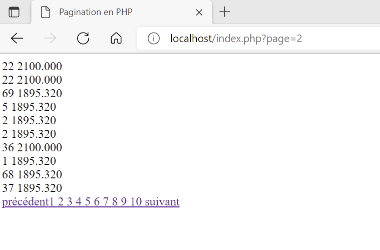

# Cours_PHP

Le document index.php contient une méthode pour faire de la pagination à la fois avec des boutons suivant et précédant et à la fois en affichant des boutons pour chaque page et les reliant aux liens correspondant.

Cette méthode s'appuie sur l'utilisation d'une table mysql appelé salariepro donc les données correspondent aux valeurs contenues dans le ficher .csv joint.
Ces dernières ont préalablement été intégrées à mySQL dans une database nomée Paris8.

Cette méthode ne contient que le code PHP brut sans toucher à l'esthétique.

Le rendu dans l'exemple de la page 5 est le suivant :

