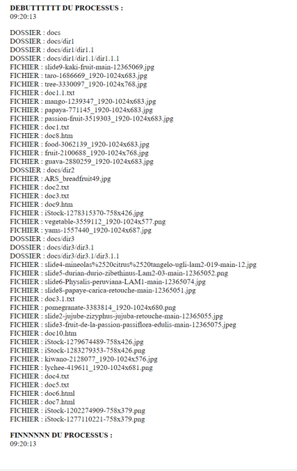
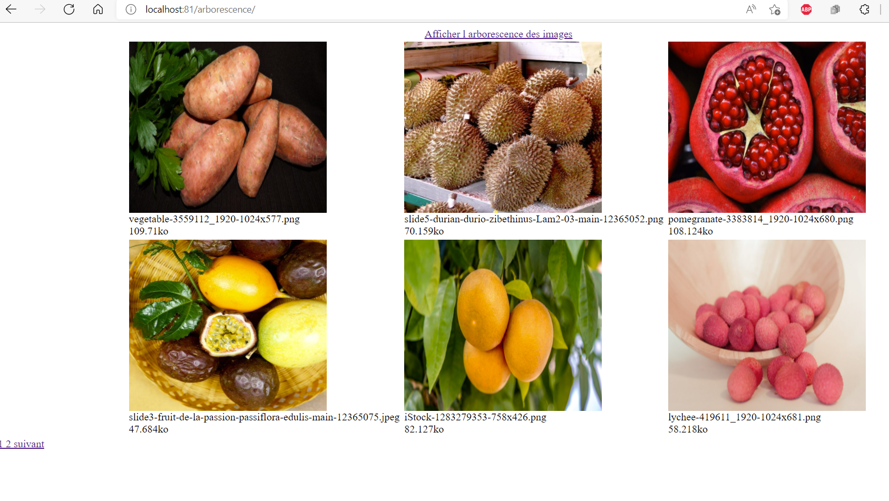

# Travail 3 

L'objectif de cette partie est de récupérer tous les chemins d'accès aux images contenues dans le dossier docs et ses sous dossers

Dans un premier temps il faudra afficher tous les dossiers et fichiers puis insérer dans la BDD seulement le nom, la taille, le chemin et l'extension des images.

Dans un deuxième temps on affichera en reprenant le script de pagination les images avec un affichage de 6 images par page :

On pourra accèder a l'arborescence des images depuis le lien 
