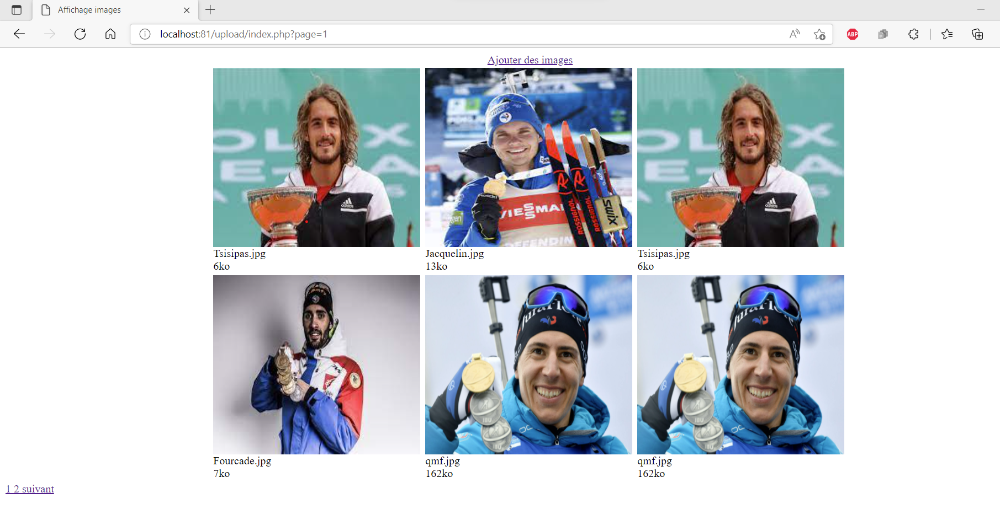
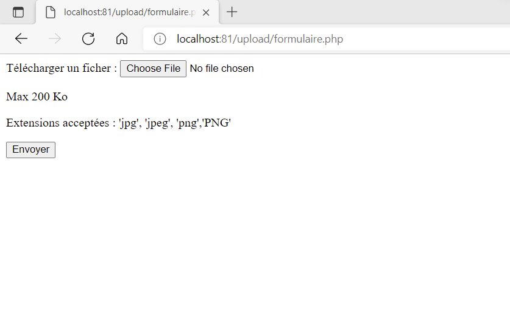
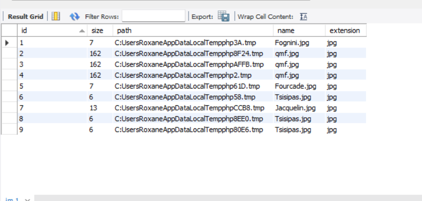
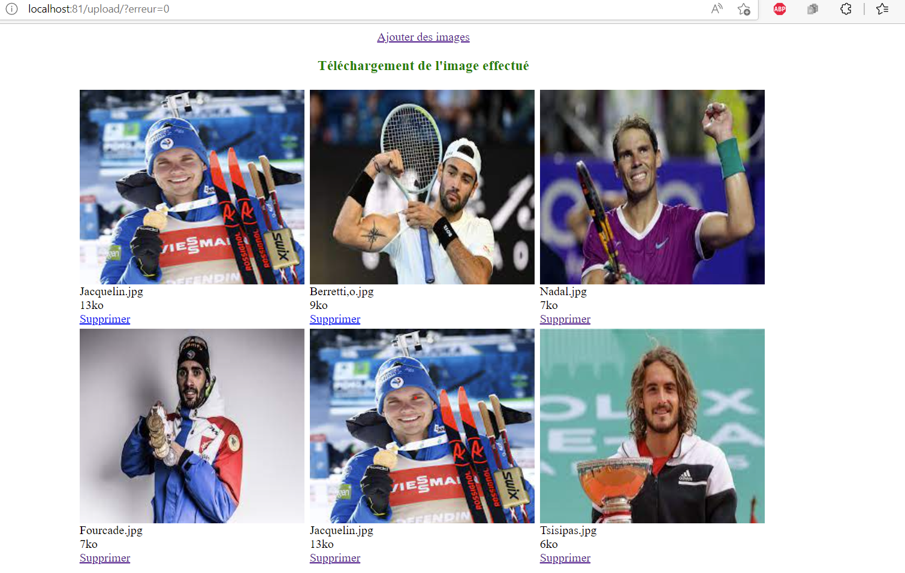
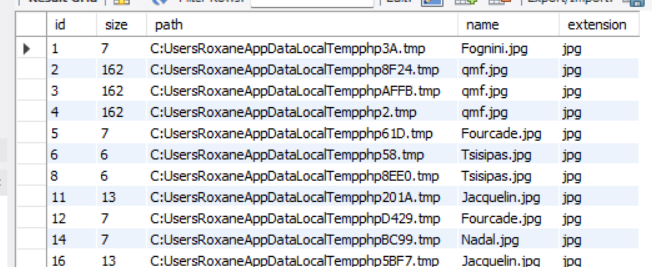

# Partie 1 du projet final : Pagination suppression et téléversement images

L'utilisateur pourra dès à présent télécharger des images de son ordinateur et les afficher sur une page web. Il pourra également supprimer une image si il souahite s'en séparer

L'interface initiale est la suivante :

Il y a 6 images par pages. Aussi, sachant que la base de données ne contient que 8 images, il y aura 2 pages.

Si l'utilisateur souhaite télécharger une image il suffit qu'il clique sur le lien 'ajouter des images' qui le renverra vers le formulaire suivant:

Si le téléchargement s'est correctement déroule alors il en sera informé et sa nouvelle image sera affichée en première position étant donné que l'affichage se fait de l'image la plus récente ajoutée à la plus ancienne

Il y a alors mise à jour de la base de donnée : 

En revenche, si une erreur apparait il aura un message d'ereur avec la cause identifiée.

Une  nouvelle fonctionnalité a été ajoutée pour supprimer les images à la fois concernant l'affichage sur la page web mais aussi de la base de données et du dossier image dans lequel les images ajoutées ont été téléversées.

Par exemple, si on prend l'interface suivante

Et si l'utilisateur souhaite supprimer l'image de Berrettini, il appuiera sur le bouton 'supprimer'

On voit bien que l'image a été correctement supprimer et il n'appararaitra plus non plus dans la BDD et dans le dossier.

